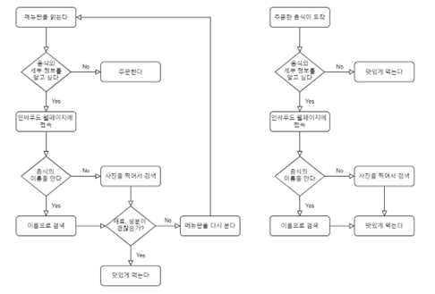

# inssa-food-client
inSSA-Food 프로젝트 co-work를 진행하는 레포입니다.

  

## Inssa Food 소개

   

## Core 기능 시연

### 시연 영상 내 코어기능
1. 한식 업로드 및 판별 (정확도 90% 내외)
2. 해당 한식 관련 기본설명과 정보 & 주문음성 오디오 & 레시피 제공
3. 내 한식 history 기록,저장 등 CRUD 제공
  

### 시연 영상 외 사이드 기능
1. 인트로 페이지
2. 로그인, 회원가입
3. 소셜 로그인, 회원가입
  

   

## 협업 개요 및 회고

 

해당 프로젝트에 참여한 팀원 세명 비전공자로 모두 팀워크, 특히 온전한 배포까지 이르는 웹서비스 개발 경험이 거의 전무하며, 기초적인 프론트 & 백 학습경험만을 가지고 있었다. 우리의 모든 시도가 새로운 도전이자 개척이었다.  

이러한 팀 구성의 특수성과 더불어, 나는 비교적 작은 서비스인 만큼 프론트-백-배포 까지의 모든 개발 스택과 경험을 온전히 경험해보고 싶은 마음이 있었으며, 결정적으로 방학 중 2주라는 짧은 시간 내 빠른 호흡의 개발이 필요한 상황이었다. 
  

이런 복합적 이유로 팀원들에게 요구사항 명세서를 기반으로 프론트-백에 이르는 기능단위별 무한책임 개발을 제안했고,
팀원 모두 긍정적으로 받아들였기에, 나를 포함한 팀원 모두가 대부분의 커버리지를 포함하는 풀스택 개발을 수행할 수 있었다.
 
 

제안한 이 방식은 짧은 호흡의 크런치가 뒷받침되어야 하는 협업방식이었기에, 짧게는 매일 길게는 이틀정도의 간격의 대면 회의를 가져야 했으며 밤에는 필요 시 각자의 집에서, 방에서 디스코드 비대면 회의를 가지며 개발에 매진했다.
  

회의시엔 각자 담당기능 별 현황과 문제 그리고 구현방법 등의 다양한 이슈를 공유하였고 새로운 태스크를 할당했으며, 충분한 페어프로그래밍의 시간을 가지곤 했다.   

해당 프로젝트에서는 지금껏 경험해보지 못한 여러 생소한 문제(특히 백엔드: 서비스 배포, 이미지 저장 및 처리, ai model 배포 시 메모리 문제 등 )를 마주해볼 수 있었는데, 이 때의 페어프로그래밍 경험들은 개인적인 성장과 문제 극복에 정말 큰 도움이 되었다.   

작고 미흡한 비전공자들의 조직이었으며, 크고 작은 어려움과 좌절 또한 많았으나, 열정적이며 건전한 협업문화를 직접 만들어보고 몰입해본 경험에 더불어 페어프로그래밍을 통해 함께 문제원인을 정확히 진단해보며 막막했던 문제들의 해결책을 **결국, 끝내** 찾아낸 그 경험들이 내가 이번 프로젝트를 통해 얻은 가장 큰 자산이었지 않나 생각한다.

 

+ **'됐어요 여러분..!' 을 외치며, 함께 환호하는 것이 얼마나 기분이 좋았었는지 모른다.**

  

## 내 역할과 주요 이슈
 
앞서 설명한 만큼, 해당 프로젝트는 매우 작은 기능단위별로 수행한 유기적인 협업 이었으므로, 프론트! 백! 처럼 분명히 각자의 역할을 설명하긴 힘들겠다. 

 

GITHUB ORGANIZATION의 PROJECT TASK에 각자의 역할을 모두 할당해두었으나 너무나도 많은 것들이 적혀있으므로 따로 첨부하지는 않겠다.

 
굳이 나누자면 이번 프로젝트를 결정하는 핵심 TASK는 크게 나눠 세가지였다고 생각한다.
  

1. 우리의 코어 기능인 AI MODEL 개발 및 학습
2. 프론트(react) / 백(express & flask) api 서버
3. 배포환경 구축 및 배포

  
이 중 내가 핵심적으로 관여한 파트는 2, 3의 프론트/백 개발과 배포환경 구축 및 배포였다. 

 
기획 시 데이터관리론 및 시스템 설계과목의 기억을 더듬으며 데이터 스키마를 정의하고 ERD를 그려봤던 기억과, 

 
 협업경험이 전무한 팀원들을 위해 깃허브 등 협업 방법론과 규칙을 정립하고 협업을 위한 프로세스와 커맨드 등을 문서화해서 공유 했던 활동 등이 추가적으로 기억에 남는다.

  
AI 모델 개발은 홍래님이 전적으로 담당해주셨고 참 고생 많이하셨다. 

또한 우분투 메모리 크기 이슈로 인해 새롭게 MobileNet을 이용해 늦은 저녁까지 AI모델을 학습시키고 있었던 어느 날 밤 카페에선, 홍래님에게 구축, 학습과정과 동작원리 등을 여쭤봤는데 참 막힘없이 친절하게 설명해주셔서 비교적 짧았던 내 AI관련 지식에 큰 보탬이 되었고, 협업을 통한 학습의 의미를 진정으로 느끼게 된 중요한 기억 중 하나로 남아있다.
  

### 1. 프론트 엔드 이슈
기능 과 뷰 구현의 비교적 자잘한 작업은 배제하고 기억에 남는 이슈만 정리한다.

 

**1-1. : 프론트 환경 구축**: 프론트엔드 개발에서 가장 기억에 남는 TASK는, 프로젝트 환경 구축이었다. 기능단위별 책임개발이라는 특수한 협업방식을 제안한 만큼, 이 협업방식에 어울리는 프로젝트 디렉토리를 구축해야했고 여러 프로젝트 접근 및 개발방법론을 찾아보았다. 그리고 **DDD, 도메인 주도 개발** 방법론에 착안하여, 각 기능 및 요소를 도메인으로 상정하여 기능을 중심으로한 디렉토리별로 하위요소들을 묶어 기초 개발환경을 구축하였다.

 

**1-2: 이미지와 쿠키:** 우리는 모두 이미지 저장과 활용에 대한 기초지식이 전무하여 고초를 겪은 기억이 있다. 이미지 저장과 활용을 위해 여러 방법을 찾아보았고, 홍래님께서 blob 라이브러리를 활용한 이미지 데이터 객체화 기법을 제시하여 해결했다. 하지만 컴포넌트간 이동과 데이터 베이스에서 꺼내오는 시점에 의해 일련의 순차적 작업이 복잡하게 꼬여있어, 우리는 쿠키를 사용해 이미지 url을 저장하고 접근하는 방식을 채택했다. 이제와서 후회되는 것은 이 부분에서 우리가 리덕스를 적극 활용했다면, 불필요한 쿠키사용을 줄일 수 있었을 것이라 생각한다. 현재에는 리덕스툴킷을 사용하고 있는데, 상태관리 라이브러리 없이 어떻게 개발했었나 싶다.

 

**1-3: 디자인 설계(css):** 계획적 스타일 설계의 중요성을 여실히 깨달았다. 계획적 설계 없이 부트스트랩, mui등의 외부 디자인 라이브러리나 코드를 남용하면 식별이 어려운 스타일이 많아지며 우리 스타일과의 충돌에 의해 리팩토링에 더욱 많은 시간이 소요됨을 크게 배웠다. 사실 기획단계부터 우려했던 문제였으나, 안일했다고 생각한다. 또한 어렴풋이만 알았던 styled-component의 진정한 필요성 중 하나를 느낄 수 있었다. 컴포넌트 별 스타일을 css시트에서 클래스명을 기반으로 찾아다니는 것이 큰 비용소요를 야기했고, 이를 컴포넌트가 담긴 시트 내에서 component 기반으로 스타일링 할 수 있다면 유지보수와 체계적 스타일링 시 큰 도움이 될 수 있을 것이라 느꼈다. 그리고 현재 캡스톤 디자인으로 진행중인 '머리할래'프로젝트에선 styled-component를 적극 반영하고 있다. 

 

**1-4: 버전 분리의 필요성:** 프로젝트를 진행할 당시엔 **무중단 배포**의 개념조차 몰랐다. 로컬작업 시 이미지나 연결 uri 등을 하드코딩 해뒀던 것은 이후 배포로 넘어갔을 때 여러 불편을 야기했을 뿐만 아니라, 보안 취약점도 야기했다. env에 변수로 ip, port나 주요 path를 관리하며 개발버전과 배포버전을 나눠둬야 함을 여실히 깨달았고 이후 버전별 env변수를 작성하고 관리하도록 적용했다.

  

### 2. 백엔드 이슈
백엔드 구현 은 길이 상 간단하게 리스트업만 하겠다.

 

**1-1 이미지 저장:** 이미지 저장을 위한 전용 라우터를 구축했다. multer라이브러리를 조사, 학습하고 적용했다. 이미지  저장에 대한 개념이 없었기에, 이것도 참 쉽지 않았다. 나중에 알게된 개념이지만 aws s3를 이용해 이미지 스토리지로 활용하는 방법을 내 개인멘토 jason에게 배웠고, 새로운 프로젝트인 머리할래에선 이를 적용하고 있다.

 

**1-2 몽고DB 해킹 및 권한:** 우리는 배포버전에서도 몽고DB의 계정에 PW를 걸지 않았었기에 몽고DB를 해킹당했고 비트코인을 요구받았다. 다행이도 중요 데이터는 전무했기에 큰 문제는 발생하지 않았으나 테스트용 더미 데이터가 자꾸 사라져 서버 테스트 시마다 새로운 데이터를 넣어줘야 하는 귀찮음이 발생했다. 결국 내가 백엔드 및 콘솔환경과 DB에 친숙했었기에 조사 및 공부하며 몽고DB의 계정 및 권한 설정 등을 수행했다. 보안의 중요성에 대해 얕게나마 체험할 수 있었으며, DB 및 CLI환경과 더욱 친해진 계기 중 하나가 되었다. 

  

### 3. 배포 이슈
전체적으로 AI모델을 올리기 위한 배포환경 구축에서 참 어려움을 많이겪었었고 적지않은 시간 이 문제 해결을 위해 조사하고 공부했던 기억이 남는다.

 

**1-1: Tensorflow.keras 버전이슈**: 가장 힘든 기억 중 하나이다. 홍래님께서 처음으로 AI모델을 구축해 가져오신 후, 이를 개발버전에서 테스트해보기 위해 우리의 flask 서버에 탑재해 돌려봤는데, **CUDA** 관련 오류가 무수히 발생했다. 바로 직전주차 쯤, 학부 연구를 진행하며 로컬에서 GPU를 사용하기 위해 로컬환경에 CUDA 사용환경을 구축해본 아주 우연찮은 경험에 근거해 이것이 어렴풋이 자바관련 이슈라는 것을 알 수 있었는데, 이것이 우리의 프로젝트에서 발생할 줄은 몰랐다. 어쨌든 무수한 조사 끝에 내린 결론은, CUDA를 위한 jdk버전이 해당 파이썬 버전 그리고 tensorflow.keras버전과 호환이 맞지 않는다는 것이었다. anaconda를 사용해 특정 jdk와 호환 가능한 버전의 python 버전인 3.8버전 그리고 이외 라이브러리 버전들을 담은 콘다 격리환경을 만들어 돌려본 결과 성공적으로 돌아갔던 기쁨의 순간을 맛봤다. 그리고 이를 배포환경 ubuntu서버에도 이식하였다.

 

**1-2: AI모델의 크기 문제**: 이 또한 힘든 기억 중 하나이다. 우리의 코어기능에서 작동해야 할 AI모델을 학습하고 구축하는 것은 그리 오래걸리지 않았다. 하지만, 네이버 클라우드의 무료 MICRO서버상에서 이를 돌리면 엄청난 시간소요 끝에 항상 특정 에러 메시지를 뱉어냈다. 몇날몇일의 구글링과 해외 문서들을 참조해가며 내린 나의 결론은, 배포를 위해 구축한 ubuntu 서버의 memory 부족이었다. 그럴 만한 것이 1GB밖에 안되는 메모리를 가진 서버에 크기만 1.2GB의 모델을 올렸던 것이다. 이 때, 포트별 메모리 사용을 확인하고, 시스템 리소스를 확인하는 여러 테스트를 거치며 ubuntu와 리눅스 환경과 꽤나 친해질 수 있었다. 우리는 매우 높은 정확성을 보여줬던 첫 모델을 포기하고, 가능한 한 작은 학습모델을 만들기로 결정하였고 MobileNet등을 학습해 올려보는 등 다양한 시도를 하였고.. 홍래님이 전적으로 갈려나가신 끝에 결국 높은 정확도와 적합한 크기의 모델을 만들어내주셨다.

 

**1-3: 네트워크 지식의 부재**: 우리는 클라와 메인 API서버, Flask서버 모두 네이버 클라우드로 구축한 Micro ubuntu 서버에 배포했다. 가이드라인은 이곳 저곳 나와 있었기 때문에, 배포 구축을 할 수 있었으나, 공인IP, 비공인IP, 포트포워딩, CORS, 게이트웨이 등 수많은 생소한 네트워크 용어들 속에서 적지않은 혼란을 느꼈다. 물론 당시에 우리 프로젝트 개발을 위한 ip, 포트, http request, security과 비동기 통신 등 아주 기본적인 지식은 어느정도 갖추게 되었으나. 네트워크 지식의 필요성을 분명히 느꼈고, 프로젝트가 끝나고 마지막 학기를 진행중인 지금 정통대의 컴퓨터 네트워크 강의를 수강하며 부족한 지식을 보충해나가고 있다.

   

## Co-Work Space
---

### [**NOTION: 인싸푸드**](https://www.notion.so/a4954223b7db40328712652a080aab24?v=ccefa0f4dc2142f995fbd3383f288ec1)  
### [**Figma: 인싸푸드**](https://www.figma.com/files/team/1051496486497256392/inssaFood?fuid=1051496482104027174) 

   

---
 

## 기획 초안 ( 2022년 7월 11일 )  

### 2022 토이 팀 프로젝트 수행
 

#### 팀명 : 인싸푸드
#### 주제 : 이 음식 뭐야? 인싸푸드
 

### 개요  
Ingredient Insight, 인싸푸드. 외국인 관광객 등을 위해 음식 사진을 통해 맵기, 채식, 할랄, 알러지 정보 등 성분검색을 제공하는 웹 서비스. 

 

### 배경 및 목표
관광객의 현지 식당 및 음식 정보가 부족하다. 이는 국가나 개인간의 식문화 차이의 문제(ex. 할랄, 비건) 혹은 개인의 신체적 결함에 기인한 섭취할 음식의 알러지 유발 문제 등을 야기할 수 있다. 해당 프로젝트는 국내외의 해외여행 관광객을 타겟으로 음식 상세정보를 제공하고자 한다. AI 이미지 분류 모델을 활용해 사용자가 메뉴판 등에서 촬영한 텍스트 정보나 음식 사진을 분류하여 해당 음식의 상세 정보 제공 서비스를 제공한다. 또, 식당(음식) 평가 커뮤니티를 웹앱 서비스로 구현하여, 관광객의 현지 식당과 음식 정보의 접근성을 높임으로써 이런 정보 부족 문제를 해결하고자 한다.

 

### 일정

1. 8월 5일 ~ 7일 : 정의 및 분석 
2. 8월 8일 ~ 10일 : 텐서플로우 학습. 프런트/ 백구성
3. 8월 11일 ~ 12일 : 설계 (산출물: 요구사항, 다이어그램, 와이어프레임)
4. 8월 13일 ~ 17일 : 구현 
5. 8월 18일 ~ 19일 : Testing 

 

### 시장성 분석

- 유사 서비스 조사 :  
  -  푸드렌즈  
  활용하는 AI기술 및 데이터 유사하나 식단관리 앱의 기능에 집중하여 재료가 아닌 영양정보를 제공한다는 점에서 본 서비스와 방향성이 다름. 푸드렌즈 앱 다운로드 수는 플레이스토어 기준 1000회 단위. 그러나 인싸푸드는 웹 기반으로 만들 것이기 때문에, 더 많은 사용자 유입을 기대함.  

  - 네이버 지도, 카카오맵  
  본 서비스들은 위치기반으로 사용자의 평가가 반영된 식당 정보를 제공한다. 주로 내국인 회원을 타겟으로 하며 메뉴, 음식에 대한 상세 정보가 제공되지 않기 때문에 방향성이 다르다.   

- 타겟 및 수요 조사 :  
  - 국내 체류 외국인 수 : 2019년 2,524,656명. 2020년 2,036,075명. 2021년 1,956,781명. // 국내 방문 외국인 수 : 31,048,752명, 35,752,704명, 5,530,350명, 2,127,176명. 코로나 시국이 끝나는 대로 다시 연간 3천만명 수준으로 회복할 것으로 예상. (출처 : 법무부 출입국통계 https://www.moj.go.kr/moj/2411/subview.do)
    - 국내 채식주의자 수 : 약 100만명에서 150만명 사이 규모 (출처 : 불교신문 이성진 기자 http://www.ibulgyo.com/news/articleView.html?idxno=160733)

  

### 데이터 수집 및 전처리
AI-hub에서 한국 음식 150종(종별 약 1천장)의 데이터를 구축한 이미지 데이터셋을 활용할 예정이다.   
한식 등 국내 특화 시각지능기술 및 서비스 개발을 위해 필요한 이미지 데이터의 제작, 수집,분류 체계를 마련하고 관련 정보가 레이블링 된 데이터이다. 한국 음식 인식성능 강화를 위해 한국 음식 150종(종별 약 1천장)의 데이터 수집 및 세그먼트 정보 등을 태깅한 데이터이다. 이 데이터는 이미 전처리가 완료된 데이터이다.
https://www.aihub.or.kr/aihubdata/data/view.do?currMenu=115&topMenu=100&aihubDataSe=realm&dataSetSn=79   

### 모델 구현
OCR,  TensorFlow 이미지 분류 모델을 활용한다. 
텐서플로우에 있는 케라스를 이용한 이미지 분류를 사용할 예정이다. 이 모델은 ImageNet 데이터베이스의 라벨로 이미지를 분류하며, CNN(Convolution Neural Network)를 사용하는데 이는 인간의 시신경 구조를 모방한 Convolution과 Pooling을 반복해 특징을 추출하고, 완전연결계층을 통해 입력된 이미지를 분류하기 위한 변별적 학습을 수행한다.   
Convolution은 인간의 시신경 구조를 모방한 Convolutional kernal을 이용하여 이루어진다. 이를 통해 이미지의 추상적인 특징을 여러 관점에서 추출해 위치에 무관한 특징을 추출한다. Pooling은 이미지의 특징을 유지하면서 차원을 축소한다.
OCR은 텍스트 이미지를 기계가 읽을 수 있는 텍스트 포맷을 변환하는 과정이다. 기존의 이미지 파일에서는 텍스트 편집기를 사용하여 단어를 편집, 검색하거나 단어 수를 계산할 수 없었다. 그러나 OCR을 사용하면 이미지를 텍스트 문서로 변환하여 내용을 텍스트 데이터로 저장할 수 있다.

  

### 기술스택 및 개발환경
- 운영 체제: windows
- 언어: HTML,CSS,JS,TS
- DB: MongoDB(NoSQL) 
- 라이브러리: react.js
- AI모델: TensorFlow
- 에디터: visual studio code
- UI 디자인: Figma
- 협업 툴: GitHub, Notion

  

### Flow Chart

